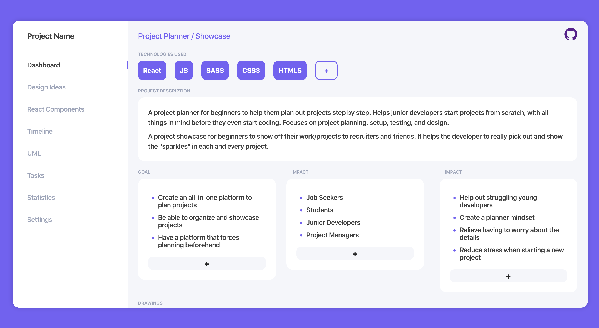

# Project Planner / Showcase

Status: **Development** - Looking for Contributers to help out :heart: 
An app I made to help myself and others showcase their projects.

This project was bootstrapped with [Create React App](https://github.com/facebook/create-react-app).

## How to Use

- Fork Repository
- Clone down forked project
- Run `npm run deploy` to deploy to gh-pages
- Visit app at `[github username]github.io/[forked project name]`
  - You can find the exact url in your repo settings under **Github Pages** section

By default the app will display static data *(the JSON data that comes from [**data.json**](src/data.json) file)*  
You can use the app in *__edit mode__* to modify through the app and then *__export__* the data to put inside `data.json` OR you can directly modify the `data.json` file yourself if you like.
When making edits in the app, all changes are saved in localStorage on your browser, meaning nobody else can view them when looking at your site other than you. They will only be able to see the data inside `data.json` statically.

## Available Scripts

In the project directory, you can run:

### `npm start`

Runs the app in the development mode. 
Open [http://localhost:3000](http://localhost:3000) to view it in the browser.

The page will reload if you make edits. 
You will also see any lint errors in the console.

### `npm run deploy`

Deploy app using gh-pages. Will deploy to project's *homepage* key inside [**package.json**](package.json#L5)
